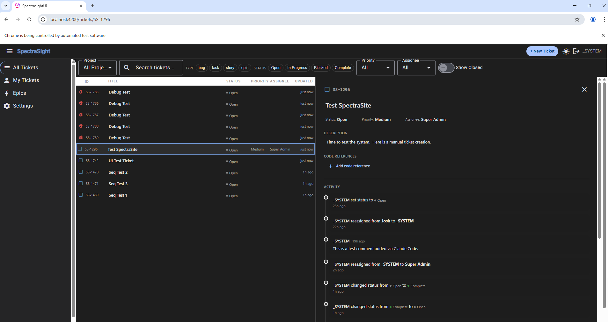

# SpectraSight

[](LICENSE)

AI-powered ticket management built on **InterSystems IRIS**, **Angular**, and the **Model Context Protocol (MCP)**. SpectraSight lets both humans and AI agents manage tickets through the same REST API — the Angular SPA for humans, an MCP server for AI assistants like Claude.

<!--  -->

## Architecture

```
┌─────────────┐     ┌─────────────┐
│  Angular SPA │     │  MCP Server │
│  (frontend/) │     │ (mcp-server/)│
└──────┬───────┘     └──────┬──────┘
       │                    │
       └────────┬───────────┘
                │ REST / JSON
        ┌───────▼────────┐
        │  IRIS REST API  │
        │    (src/)       │
        └───────┬─────────┘
                │
        ┌───────▼────────┐
        │  IRIS %Persistent│
        │   Data Layer    │
        └─────────────────┘
```

- **IRIS Backend** (`src/`) — ObjectScript classes: `%Persistent` ticket model (Bug, Task, Story, Epic), `%CSP.REST` dispatch, activity tracking, code references
- **Angular Frontend** (`frontend/`) — Angular 18 SPA with Angular Material, communicates with IRIS REST API
- **MCP Server** (`mcp-server/`) — TypeScript MCP server exposing ticket operations as tools for AI agents. See [mcp-server/README.md](mcp-server/README.md)
- **BMAD Framework** (`_bmad/`) — Build Method for AI-Driven Development workflow engine used to develop SpectraSight itself

## Prerequisites

- [InterSystems IRIS](https://www.intersystems.com/products/intersystems-iris/) (Community Edition or licensed)
- [Node.js](https://nodejs.org/) 18+
- [Angular CLI](https://angular.io/cli) (`npm install -g @angular/cli`)

## Quick Start

### 1. IRIS Backend

Import the ObjectScript classes from `src/` into your IRIS instance:

```objectscript
Do $SYSTEM.OBJ.LoadDir("/path/to/SpectraSight/src/", "ck", .errors, 1)
```

Create the `/api` REST web application:

```objectscript
Do ##class(SpectraSight.Util.Setup).ConfigureWebApp()
```

By default this targets the `HSCUSTOM` namespace. To use a different namespace:

```objectscript
Do ##class(SpectraSight.Util.Setup).ConfigureWebApp("USER")
```

Create the default project and backfill any existing tickets:

```objectscript
Do ##class(SpectraSight.Util.Setup).EnsureDefaultProject()
```

The REST API is now available at `http://localhost:52773/api/`.

### 2. Set Up Users

SpectraSight maps IRIS system usernames to display names. You must create at least one user mapping before tickets can be assigned.

In the Angular app, go to **Settings > Users** and click **Add User**. Provide:

- **IRIS Username** — the system username used to authenticate with IRIS (e.g., `_SYSTEM`, `SuperUser`)
- **Display Name** — the human-readable name shown in the UI (e.g., "Josh", "Alice")

You can also create user mappings via the REST API:

```bash
curl -u _SYSTEM:SYS http://localhost:52773/api/users \
  -H "Content-Type: application/json" \
  -d '{"irisUsername": "_SYSTEM", "displayName": "Josh"}'
```

Or via the MCP server (if configured):

```
create_user_mapping with irisUsername="_SYSTEM", displayName="Josh"
```

Users can be deactivated (toggled inactive) without deleting them. A user cannot be deleted while assigned to any tickets.

### 3. Set Up Projects

Every ticket belongs to a project. Each project has a **name** and a unique uppercase **prefix** (2-10 characters) used in ticket IDs (e.g., `SS-1`, `DATA-42`).

The setup utility creates a default "SpectraSight" project with prefix `SS`:

```objectscript
Do ##class(SpectraSight.Util.Setup).EnsureDefaultProject()
```

To create additional projects, go to **Settings > Projects** in the Angular app and click **Add Project**. Provide:

- **Name** — the project name (e.g., "Data Pipeline")
- **Prefix** — a unique 2-10 character uppercase code (e.g., `DATA`)
- **Owner** *(optional)* — the project owner's display name

You can also create projects via the REST API:

```bash
curl -u _SYSTEM:SYS http://localhost:52773/api/projects \
  -H "Content-Type: application/json" \
  -d '{"name": "Data Pipeline", "prefix": "DATA"}'
```

When creating tickets, you must select which project the ticket belongs to. The ticket ID will use that project's prefix (e.g., `DATA-1`).

### 4. Angular Frontend

```bash
cd frontend
npm install
ng serve
```

Open `http://localhost:4200`. The app proxies API requests to IRIS at `localhost:52773`.

### 5. MCP Server

```bash
cd mcp-server
npm install
npm run build
```

Add the server to your MCP client config (e.g., Claude Desktop). See [mcp-server/README.md](mcp-server/README.md) for full configuration details.

Copy `.mcp.json.example` to `.mcp.json` and fill in your IRIS credentials:

```bash
cp .mcp.json.example .mcp.json
```

## Project Structure

```
SpectraSight/
├── src/                    # IRIS ObjectScript backend
│   └── SpectraSight/
│       ├── Model/          # %Persistent ticket classes
│       ├── REST/           # %CSP.REST dispatch & handlers
│       ├── Util/           # Setup, validation, helpers
│       └── Test/           # %UnitTest classes
├── frontend/               # Angular SPA
├── mcp-server/             # MCP server (TypeScript)
├── _bmad/                  # BMAD development framework
├── _bmad-output/           # Generated planning & implementation artifacts
└── docs/                   # Project documentation
```

## License

This project is licensed under the MIT License — see [LICENSE](LICENSE) for details.
