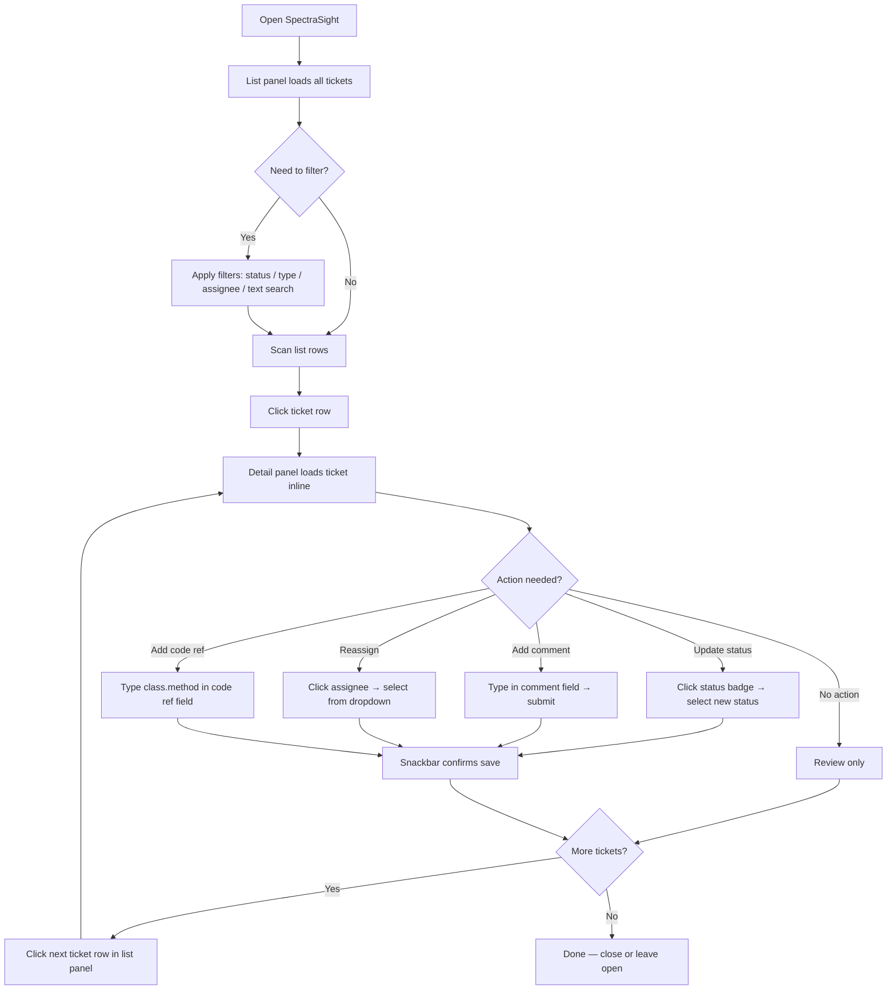
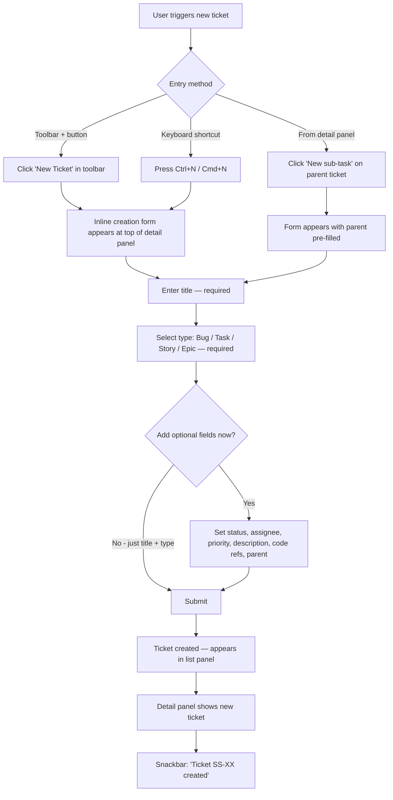
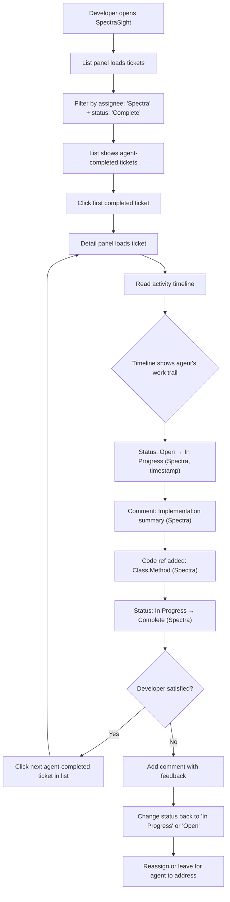
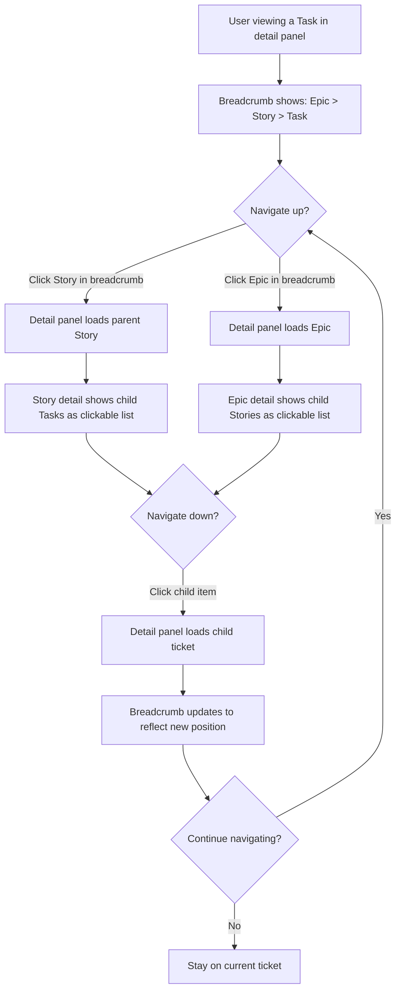

# UX Design Specification SpectraSight

**Author:** Developer
**Date:** 2026-02-15

---

<!-- UX design content will be appended sequentially through collaborative workflow steps -->

## Executive Summary

### Project Vision

SpectraSight is an IRIS-native ticketing and project management system that eliminates the friction between work tracking and the InterSystems development environment. It serves two primary interfaces: an Angular SPA for human developers and team leads, and an MCP server for AI coding agents — both operating against the same IRIS persistent object layer. The UX must feel purpose-built for IRIS developers: information-dense, efficient, and deeply aware of the ObjectScript ecosystem.

### Target Users

**Alex — IRIS Developer (Primary)**
Senior developer managing a complex IRIS codebase, either solo or on a small team (2-5 people). Wears multiple hats from planning through implementation. Values efficiency and minimal context-switching. Needs to link ObjectScript classes and methods directly to tickets and navigate between work items and code seamlessly. Desktop-primary, Chromium browser.

**Spectra — AI Coding Agent (Primary)**
An AI agent (e.g., Claude Code) operating as a first-class team member via the MCP server. Creates tickets, updates status, adds comments, and links code changes autonomously. Has no UI — the MCP server is its native interface. The Angular UI must surface Spectra's activity transparently alongside human activity.

**Jordan — Team Lead (Secondary)**
A senior developer who coordinates a small team of human and AI contributors. Needs quick visibility into project state — what's in progress, what's blocked, who's working on what. Uses the list view for oversight and triage, not heavy project management.

### Key Design Challenges

1. **Dual-audience coherence** — The UI must present a unified activity trail where human and AI agent actions (comments, status changes, assignments) are clearly attributed and feel like natural parts of the same workflow, not separate streams.

2. **Lightweight hierarchy** — Epic > Story > Task organization must feel optional and effortless for solo developers while remaining useful for small team coordination. The UX cannot impose project management overhead on users who just want to track bugs and tasks.

3. **Code references without code viewing** — MVP stores ObjectScript class/method references as structured fields. The design must make these references feel intentional and valuable as standalone navigation aids, not as placeholders for a missing feature. The visual treatment should naturally accommodate inline code viewing when it arrives post-MVP.

4. **List view as daily driver** — With no board/kanban view in MVP, the list view carries the full weight of browsing, filtering, triaging, and understanding project state. It must be information-dense without feeling like a raw data table.

### Design Opportunities

1. **Developer-native interface** — A clean, dense, keyboard-friendly interface that respects developer sensibilities. Minimal chrome, efficient workflows, and information density over visual padding. The antithesis of consumer-SaaS aesthetics.

2. **AI agent transparency** — First-of-its-kind UX for showing AI agent participation in a ticketing workflow. Clear, natural attribution of agent actions alongside human activity creates a genuinely novel experience in project management tooling.

3. **Code reference as ecosystem signal** — Structured ObjectScript class/method reference fields (distinct from free-text descriptions) immediately signal that this tool understands the IRIS ecosystem. Well-designed reference fields build trust and anticipation for the post-MVP code viewing capability.

## Core User Experience

### Defining Experience

The core experience of SpectraSight is **human-AI collaborative ticket management**. The product's value is not in tracking work — any tool does that. The value is that humans and AI agents work the same tickets as equals: creating, updating, commenting, and completing work through their respective interfaces (Angular UI and MCP server) with every action flowing into a single shared workspace. The defining moment is when a developer sees an AI agent's ticket updates alongside their own and it feels natural — not like automation, but like teamwork.

### Platform Strategy

- **Platform:** Web application (Angular SPA) served from IRIS or any static file server
- **Primary input:** Mouse and keyboard (desktop-first)
- **Browser support:** Chromium-based browsers (Chrome, Edge, Brave)
- **Offline:** Not required — IRIS instance must be available
- **Responsive:** Nice-to-have; desktop is the primary viewport
- **MCP server:** stdio transport for AI agent access — no UI surface needed for agent interactions, but agent activity must be fully visible in the web UI

### Effortless Interactions

- **Ticket creation** must be near-instant — minimum required fields, smart defaults, no wizard. A developer mid-thought or an AI agent mid-workflow should never hesitate to capture work
- **List filtering** should feel like reflex — type filters, status filters, assignee filters available without navigating away from the list
- **Hierarchy navigation** should be ambient — parent/child relationships visible in context, clickable but never forced. Creating a standalone Task is as natural as creating one under an Epic
- **Code reference entry** should be a structured field, not a free-text hunt — type a class name, optionally a method, done

### Critical Success Moments

1. **First ticket with a code reference** — The user adds an ObjectScript class/method reference and sees it displayed as a structured, first-class field. This is the "this tool gets me" moment
2. **First AI agent activity in the timeline** — The user sees "Spectra updated status to Complete" or "Spectra commented" alongside their own activity. This is the "we're working together" moment
3. **First fast triage session** — The user opens the list view, filters to their in-progress tickets, scans status, clicks into one, updates it, and is back to the list in seconds. This is the "I'm never going back to Jira" moment
4. **First hierarchy click-through** — The user navigates from Epic to Story to Task and back, understanding the full scope of work at a glance. This is the "my project makes sense" moment

### Experience Principles

1. **Collaboration is the product** — The core experience is humans and AI agents working the same ticket board as equals. Every design decision reinforces that SpectraSight is where human+AI teamwork happens
2. **Ticket creation is frictionless** — Capturing work must be fast enough that neither a developer mid-thought nor an AI agent mid-workflow hesitates. Minimum fields, smart defaults, get out of the way
3. **Activity tells one story** — Human comments, AI agent updates, status changes, code references all flow into a single clear timeline. No separate "bot activity" section. Agent actions are first-class events
4. **Developer density over consumer polish** — Information-rich, compact, keyboard-friendly. Developers scan, they don't browse. Respect their time with density, not whitespace

## Desired Emotional Response

### Primary Emotional Goals

- **Efficient and in control** — Users feel they can see and act on their project state in seconds, not minutes. The tool accelerates their workflow rather than adding overhead
- **Understood** — The interface feels purpose-built for IRIS developers. ObjectScript code references, developer-density layout, and minimal ceremony signal "this was made for you"
- **Confident** — Full visibility into what's happening across the project, including AI agent activity. No black boxes, no guessing what changed or who did it
- **Unburdened** — Tracking work feels lightweight, not like a chore. The tool stays out of the way and lets developers focus on code

### Emotional Journey Mapping

| Stage | Desired Feeling | Design Implication |
|-------|----------------|-------------------|
| **Discovery** | Curiosity + recognition | "An IRIS-native ticketing tool with AI agent support — finally" |
| **First use** | Ease + pleasant surprise | Install on IRIS, create first ticket in minutes. No complex setup |
| **Core loop** | Flow + efficiency | List → detail → update → back to list feels fast and seamless |
| **AI collaboration** | Trust + partnership | Agent activity appears naturally in the timeline — transparent, not magical |
| **Returning** | Familiarity + confidence | Project state is immediately clear. Pick up exactly where you left off |
| **Error states** | Calm + informed | Clear error messages, no data loss anxiety. IRIS persistence provides safety net |

### Micro-Emotions

**Critical to get right:**
- **Confidence over confusion** — Every screen should make the current state obvious. No ambiguity about what a ticket's status is, who's assigned, or what happened last
- **Trust over skepticism** — AI agent actions must be transparent and attributable. Users need to trust what Spectra did without having to verify every change
- **Accomplishment over frustration** — Completing a triage session, closing a ticket, or seeing an agent finish a story should feel like progress, not paperwork

**Actively avoid:**
- **Overwhelm** — Too many features, fields, or options. SpectraSight must resist the urge to become Jira. Keep it lean
- **Distrust** — Opaque AI agent activity. If users can't see exactly what the agent did and when, the collaboration promise breaks
- **Abandonment** — A "half-built" feeling. MVP must feel complete and intentional within its scope, not like a prototype missing features

### Design Implications

- **Efficiency → Dense, scannable layouts.** Compact list rows, visible status badges, inline metadata. No card-heavy UI that wastes vertical space
- **Understood → IRIS-native touches.** ObjectScript code reference fields are first-class UI elements, not afterthoughts. Class.Method notation displayed with monospace styling
- **Confidence → Unified activity timeline.** Single chronological stream on ticket detail showing all human and agent actions with clear attribution
- **Unburdened → Minimal required fields.** Ticket creation asks for title and type. Everything else is optional and can be set later
- **Trust → Agent attribution.** Agent comments and status changes show the agent name, timestamp, and action taken — same visual weight as human activity

### Emotional Design Principles

1. **Respect the developer's time** — Every interaction should feel faster than expected. If a developer thinks "that was quick," we've succeeded
2. **Transparency builds trust** — Make AI agent activity visible, attributable, and auditable. Never hide what happened or who did it
3. **Completeness within scope** — MVP should feel like a finished product that does fewer things, not an unfinished product that will do more things later
4. **Quiet confidence** — The interface should feel assured and stable, not flashy. Developer tools earn trust through reliability and predictability, not animation

## UX Pattern Analysis & Inspiration

### Inspiring Products Analysis

**VS Code — "Everything at your fingertips"**
The benchmark for developer tool UX. VS Code proves that information-dense interfaces can feel effortless when the hierarchy is clear and access patterns are fast. Key UX strengths: command palette for instant action access, sidebar + editor split for context-while-working, dense layout that never feels cluttered, and features that stay invisible until needed. VS Code feels like an extension of thought, not a tool you have to operate.

**GitHub Issues — "Just part of the workflow"**
The closest existing model for what SpectraSight's ticketing experience should feel like. GitHub Issues succeeds by being lightweight and developer-native: issue creation is title + description (everything else is optional), markdown is the natural language, and the activity timeline seamlessly mixes human comments, bot actions, status changes, and cross-references into a single stream. It doesn't feel like "project management" — it feels like part of development.

**Jira — "Powerful but cautionary"**
Jira's filtering (JQL) and saved views are genuinely useful for triage at scale — this pattern is worth adopting. But Jira is primarily a cautionary reference: field bloat, mandatory workflows, admin overhead, and enterprise ceremony are the exact opposite of SpectraSight's "unburdened" goal. Jira demonstrates what happens when a tool prioritizes process compliance over developer productivity.

### Transferable UX Patterns

**Navigation Patterns:**
- **VS Code's command palette model** — Consider a quick-action shortcut for ticket creation, search, and navigation without mouse. Supports the "everything at your fingertips" goal
- **GitHub's flat list with inline metadata** — Compact rows showing type icon, title, status badge, assignee, and timestamp. Scannable without expanding. Directly applicable to SpectraSight's list view

**Interaction Patterns:**
- **GitHub's minimal creation flow** — Title is the only required field. Type, status, assignee, parent, and code references can be set on creation or added later. No multi-step wizard
- **GitHub's unified activity timeline** — Comments, status changes, assignments, and bot actions in one chronological stream. This is the exact pattern for SpectraSight's human+AI collaboration trail
- **Jira's filter/saved views** — Powerful filtering by type, status, assignee, and text search. Useful for triage workflows without requiring a separate board view

**Visual Patterns:**
- **VS Code's information density** — Tight vertical spacing, monospace where appropriate, subtle color coding for state. No padding-heavy card layouts
- **GitHub's label/badge system** — Color-coded type and status indicators that are scannable at list level without reading text

### Anti-Patterns to Avoid

- **Jira's field bloat** — Dozens of fields on ticket creation, many mandatory. Creates friction and discourages quick capture. SpectraSight must keep required fields to an absolute minimum
- **Jira's workflow rigidity** — Forced status transitions, admin-configured workflows, transition screens. SpectraSight's status changes should be direct: click a status, pick the new one, done
- **Separate "bot activity" sections** — Some tools segregate automated/bot activity from human activity. This undermines the "collaboration is the product" principle. Agent actions belong in the main timeline
- **Consumer-SaaS whitespace** — Large padding, oversized cards, hero sections, and decorative elements. Wastes screen real estate that developers need for information
- **Onboarding tours and tooltips** — Developer tools should be self-evident. If the UI needs a tour, the UI needs simplification

### Design Inspiration Strategy

**Adopt directly:**
- GitHub Issues' unified activity timeline — human and agent actions in one stream
- GitHub Issues' minimal ticket creation — title + type, everything else optional
- VS Code's information density and monospace styling for code references
- Jira's text-based filtering and saved views for list triage

**Adapt for SpectraSight:**
- VS Code's command palette concept → simplified quick-create and quick-navigate shortcuts
- GitHub's label system → ticket type icons and status badges optimized for SpectraSight's four types (Bug, Task, Story, Epic)
- Jira's hierarchy navigation → lightweight breadcrumb-style parent/child links, not Jira's deep project/board/sprint nesting

**Avoid entirely:**
- Jira's field bloat and mandatory workflows
- Separate bot/automation activity sections
- Consumer-SaaS visual padding and decorative UI
- Multi-step ticket creation wizards
- Onboarding tours that compensate for poor UI clarity

## Design System Foundation

### Design System Choice

**Angular Material** with density customization — the established, themeable design system maintained by the Angular team.

### Rationale for Selection

- **First-party Angular integration** — Angular Material is maintained by the Angular team itself. For a solo developer + AI agent workflow, this eliminates integration friction, reduces dependency risk, and ensures components stay compatible with Angular updates
- **Density system** — Material Design provides an explicit density scale that compacts components for data-heavy, desktop-primary applications. This directly supports the "developer density over consumer polish" principle without fighting the framework
- **Complete component library** — Table (mat-table), toolbar, sidenav, dialog, chips, badges, form fields, menus, and autocomplete are all production-ready. Every major SpectraSight UI element (list view, ticket detail, filters, status badges, code reference fields) maps to an existing Material component
- **Built-in accessibility** — ARIA attributes, keyboard navigation, focus management, and screen reader support come standard. Meeting accessibility requirements without custom implementation effort
- **Themeable** — Custom color palettes, typography, and component overrides via design tokens prevent the "generic Material" look while keeping the component benefits

### Implementation Approach

- **Angular Material v3 (MDC-based)** — Use the latest Material Design Components implementation for Angular
- **Density: -2 (maximum density)** — Apply Material's highest density setting globally for compact, developer-appropriate spacing
- **Custom theme** — Define a SpectraSight-specific color palette and typography scale that feels purposeful, not default
- **Component-first development** — Use Material components as the base, override styling only where SpectraSight's UX requirements demand deviation (e.g., list row density, timeline layout)
- **CDK utilities** — Leverage Angular CDK (Component Dev Kit) for custom behaviors like drag-and-drop (future board view), virtual scrolling (large ticket lists), and overlay positioning

### Customization Strategy

**Theme Overrides:**
- Custom color palette — move away from default Material purple/teal to a palette that signals "developer tool" (muted, professional tones)
- Typography — use a system font stack for UI text, monospace for ObjectScript code references and class names
- Reduced border-radius — sharper corners for a more utilitarian, developer-tool aesthetic
- Tighter spacing — leverage density tokens to minimize padding without sacrificing touch targets (desktop-primary, so smaller targets are acceptable)

**Custom Components (built on Material/CDK foundations):**
- **Ticket list row** — Custom dense row component using mat-table with inline type icon, status badge, priority indicator, assignee, and timestamp
- **Activity timeline** — Custom timeline component for unified human+agent activity stream (no Material equivalent exists)
- **Code reference field** — Custom input component with monospace display for ObjectScript class/method notation
- **Hierarchy breadcrumb** — Lightweight parent/child navigation component (Epic > Story > Task)
- **Status badge** — Custom chip variant with color-coded status (Open, In Progress, Blocked, Complete)
- **Type icon** — Distinct icons for Bug, Task, Story, Epic — scannable at list level

**What stays Material default:**
- Toolbar, sidenav, dialogs, form fields, menus, buttons, autocomplete, snackbar notifications — use as-is with theme applied

## Defining Core Experience

### Defining Interaction

**"Humans and AI agents work the same tickets as teammates."**

SpectraSight's defining experience is the moment a developer opens the ticket list, sees completed work, and doesn't need to distinguish whether a human or an AI agent did it. The activity trail tells the story: status changed, comment added, code references linked — the same structure regardless of who performed the action. The magic is in the normalcy. When an AI agent's completed ticket looks exactly like a human's completed ticket, collaboration stops being a feature and becomes the default way of working.

### User Mental Model

The AI agent is an **equal member of the team** — not a junior developer being supervised, not a co-pilot assisting, not an automation running in the background. The agent has the same standing as any human contributor: it gets assigned tickets, updates status, adds comments, and completes work. The UI must reinforce this mental model by treating agent activity with identical visual weight and structure as human activity.

**Key mental model implications:**
- Agent names appear in the same assignee dropdown as human names — no separate "bot" category
- Agent comments use the same comment component as human comments — no "automated message" styling
- Agent status changes appear in the timeline identically to human status changes
- The list view's assignee column shows agent names the same way it shows human names

**What users bring from existing tools:**
- From GitHub: expectation that bot activity appears naturally in the issue timeline
- From Jira: expectation of powerful filtering and structured ticket fields
- From VS Code: expectation that everything is accessible quickly without hunting

### Success Criteria

The core experience succeeds when:

1. **Indistinguishable completion** — A user scanning the ticket list cannot tell (and does not need to tell) whether a ticket was completed by a human or an AI agent without looking at the assignee name
2. **3-second ticket creation** — A user can create a new ticket (title + type) and return to the list in under 3 seconds
3. **10-second triage** — A user can open the list, filter to relevant tickets, assess project state, and identify their next action within 10 seconds
4. **Single-stream comprehension** — A user reading a ticket's activity timeline understands the full history without needing to check a separate log, dashboard, or notification panel
5. **Zero-configuration collaboration** — An AI agent connected via MCP can immediately create, read, update, and complete tickets without any UI-side setup beyond initial MCP server configuration

### Novel UX Patterns

**Pattern classification: Established patterns, novel combination.**

SpectraSight does not require inventing new interaction patterns. Every individual component is familiar:
- List view with filtering (Jira, GitHub)
- Ticket detail with activity timeline (GitHub Issues)
- Hierarchical organization (Jira, Azure DevOps)
- Structured metadata fields (every ticketing system)

**The innovation is in the combination:** No existing ticketing system treats AI agent activity as first-class teammate contributions in a unified timeline. The novel pattern is **agent-as-teammate attribution** — showing AI agent names, comments, and status changes with the same visual treatment as human activity. This is a UX pattern that doesn't exist in any shipping product today.

**Teaching strategy:** None required. Users already understand ticketing systems and activity timelines. The agent-as-teammate pattern requires no education — it works precisely because it looks like what users already expect. The absence of a learning curve is the innovation.

### Experience Mechanics

**1. Initiation — Opening SpectraSight:**
- User navigates to the Angular SPA URL
- List view loads as the default landing page showing all tickets
- Immediate visibility: type icons, titles, status badges, assignees, timestamps
- No dashboard, no welcome screen, no widgets — straight to the work

**2. Core Loop — List → Detail → Update → List:**
- **Scan:** User scans the dense list view, filters by status/type/assignee as needed
- **Select:** Click a ticket row to open the detail view
- **Review:** Read description, check activity timeline (human and agent entries interleaved), view code references, navigate hierarchy breadcrumbs
- **Act:** Update status, add comment, reassign, add code reference — inline, no modal unless creating a new ticket
- **Return:** Back to list with state preserved (filters, scroll position)

**3. Feedback — Knowing it worked:**
- Status badge updates immediately on change (optimistic UI)
- Activity timeline appends new entries in real-time
- Snackbar confirmation for saves ("Ticket updated")
- List view reflects changes when navigating back

**4. Completion — Agent work review:**
- Developer opens a ticket completed by the AI agent
- Timeline shows: agent changed status to "In Progress" → agent added comment with implementation notes → agent added code references → agent changed status to "Complete"
- Developer reads the timeline, reviews the work, and moves on
- No special "review agent work" flow — it's just reading a ticket, same as any other

## Visual Design Foundation

### Color System

**Theme approach:** Light and dark modes, togglable by user preference. Follows the VS Code model — neutral backgrounds, muted chrome, semantic color used purposefully for status and type indicators.

**Primary Accent — Slate Blue**
- Used sparingly: active sidebar item, primary buttons, selected list row, focused form fields
- Light mode: `#4A6FA5` (muted slate blue — professional, not playful)
- Dark mode: `#6B8FC7` (lighter variant for dark backgrounds)
- Not Jira blue, not Material default — distinctly SpectraSight

**Surface Colors:**

| Token | Light Mode | Dark Mode | Usage |
|-------|-----------|-----------|-------|
| `background` | `#FFFFFF` | `#1E1E1E` | Page background |
| `surface` | `#F5F5F5` | `#252526` | Cards, panels, sidenav |
| `surface-variant` | `#EBEBEB` | `#2D2D2D` | Hover states, alternating rows |
| `border` | `#D4D4D4` | `#3E3E3E` | Dividers, input borders |
| `text-primary` | `#1E1E1E` | `#D4D4D4` | Primary text |
| `text-secondary` | `#6B6B6B` | `#858585` | Timestamps, metadata |

**Ticket Type Colors (muted, scannable at list level):**

| Type | Color | Light Mode | Dark Mode | Icon |
|------|-------|-----------|-----------|------|
| Bug | Red | `#C74E4E` | `#E06C6C` | Circle with dot (target) |
| Task | Blue | `#4A7FB5` | `#6B9FD5` | Checkbox square |
| Story | Green | `#4E8C57` | `#6BAF75` | Book/bookmark |
| Epic | Purple | `#7B5EA7` | `#9B7EC7` | Lightning bolt |

**Status Colors (conventional, immediately recognizable):**

| Status | Color | Light Mode | Dark Mode |
|--------|-------|-----------|-----------|
| Open | Gray | `#858585` | `#A0A0A0` |
| In Progress | Blue | `#2979C1` | `#4A9FE5` |
| Blocked | Amber | `#C78A2E` | `#E5A84A` |
| Complete | Green | `#388E3C` | `#5CB860` |

**Priority Colors:**

| Priority | Indicator |
|----------|-----------|
| Critical | Red filled icon |
| High | Orange filled icon |
| Medium | Yellow outlined icon |
| Low | Gray outlined icon |

**Semantic Colors:**
- `error`: `#C74E4E` / `#E06C6C` — form validation, API errors
- `warning`: `#C78A2E` / `#E5A84A` — blocked status, caution states
- `success`: `#388E3C` / `#5CB860` — save confirmations, complete status
- `info`: `#2979C1` / `#4A9FE5` — informational snackbars, in-progress

### Typography System

**Font Strategy:** System font stack for UI, monospace for code. No custom web fonts — faster loading, native feel, zero font-loading flash.

**UI Font Stack:**
```
font-family: -apple-system, BlinkMacSystemFont, 'Segoe UI', Roboto, Oxygen, Ubuntu, Cantarell, sans-serif;
```

**Code Font Stack (ObjectScript references, class names, method names):**
```
font-family: 'Cascadia Code', 'Fira Code', 'JetBrains Mono', 'Consolas', 'Courier New', monospace;
```

**Type Scale (using Material's density-adjusted sizes):**

| Token | Size | Weight | Usage |
|-------|------|--------|-------|
| `headline` | 20px | 500 | Page titles ("All Tickets", ticket title on detail) |
| `title` | 16px | 500 | Section headers, dialog titles |
| `subtitle` | 14px | 500 | Ticket title in list row, sidebar labels |
| `body` | 13px | 400 | Descriptions, comments, form labels |
| `caption` | 11px | 400 | Timestamps, metadata, secondary info |
| `code` | 13px | 400 | ObjectScript references (monospace) |

**Line height:** 1.4 for body text, 1.2 for headings, 1.5 for code blocks

### Spacing & Layout Foundation

**Base unit:** 4px — all spacing derives from multiples of 4px

**Spacing Scale:**

| Token | Value | Usage |
|-------|-------|-------|
| `xs` | 4px | Inline spacing, icon-to-text gap |
| `sm` | 8px | Compact padding (list row internal), badge margins |
| `md` | 12px | Standard padding (form fields, card padding) |
| `lg` | 16px | Section spacing, panel margins |
| `xl` | 24px | Page margins, major section breaks |
| `xxl` | 32px | Top-level layout spacing |

**Layout Structure:**
- **App shell:** Fixed toolbar (48px height) + collapsible sidenav (240px) + main content area
- **List view:** Full-width table, 36px row height (dense), no horizontal scrolling
- **Ticket detail:** Single-column scrollable layout, sidebar metadata panel on right (280px)
- **Grid:** No formal column grid — layout is component-driven. Toolbar and sidenav provide structural framing

**Density Approach:**
- 36px list row height (Material density -2)
- 32px toolbar actions (compact icon buttons)
- 8px internal padding on list cells
- 12px padding on form fields and panels
- Minimal vertical gaps between list rows (1px border, no row spacing)

### Accessibility Considerations

- **Contrast ratios:** All text meets WCAG 2.1 AA (4.5:1 for body text, 3:1 for large text). Status and type badge colors verified against both light and dark backgrounds
- **Color independence:** Status and type are never communicated by color alone — always paired with icon shape and/or text label
- **Keyboard navigation:** Full keyboard support via Angular Material's built-in focus management. Tab through list rows, Enter to open detail, Escape to return
- **Focus indicators:** Visible focus ring on all interactive elements (2px solid accent color)
- **Screen reader support:** ARIA labels on all interactive elements, status changes announced via `aria-live` regions
- **Reduced motion:** Respect `prefers-reduced-motion` — disable transitions when set
- **Font sizing:** Base size 13px with browser zoom support. No fixed viewport units that prevent scaling

## Design Direction Decision

### Design Directions Explored

Six design directions were generated and presented as an interactive HTML showcase (`ux-design-directions.html`) with light/dark theme toggle:

1. **D1: Sidebar + Table** — VS Code-style sidenav + dense data table
2. **D2: Full-Width List** — GitHub-style full-width list with top filter bar
3. **D3: Split Panel** — Email/Outlook-style list + inline detail panel
4. **D4: Ultra-Dense** — Spreadsheet-style maximum density
5. **D5: Hierarchy Cards** — Epic-first collapsible grouping
6. **D6: Detail-First** — Ticket detail as primary view

### Chosen Direction

**D3: Split Panel (Email/Outlook Model)** — Resizable list panel on the left, ticket detail panel on the right. Clicking a ticket row loads its detail inline without navigating away from the list.

### Design Rationale

- **Persistent list context** — The list remains visible while reviewing ticket details, eliminating the back-and-forth navigation that breaks flow in single-view layouts. Users can scan, select, review, and move to the next ticket without losing their place
- **Supports the core loop** — The list → detail → update → list experience mechanic becomes list → detail → update → next item. Faster triage, fewer clicks, better flow state
- **AI activity review** — When reviewing tickets completed by Spectra, the developer can read the activity timeline in the detail panel while keeping the full list visible to identify the next ticket to review
- **Familiar pattern** — Developers know this from email clients, VS Code's explorer+editor split, and IDE tool windows. Zero learning curve
- **Density-compatible** — The split panel works well with Material density -2 settings. The list panel uses compact 36px rows, and the detail panel has room for the full activity timeline without feeling cramped

### Implementation Approach

- **App shell:** Fixed toolbar (48px) + collapsible sidenav (240px) + split main content area
- **List panel:** Left side, resizable width (default 400px, min 300px, max 50%). Dense mat-table with type icon, title, status badge, assignee, timestamp
- **Detail panel:** Right side, fills remaining width. Scrollable ticket detail with description, activity timeline, metadata sidebar, code references, hierarchy breadcrumbs
- **Empty state:** When no ticket is selected, the detail panel shows a subtle prompt or project summary
- **Responsive behavior:** On narrow viewports, collapse to single-panel with navigation (nice-to-have, not MVP priority)
- **CDK integration:** Use Angular CDK's drag utilities for the resizable split divider

## User Journey Flows

### Journey 1: Daily Triage Loop (Alex / Jordan)

The most frequent interaction — opening SpectraSight, assessing project state, and acting on tickets. This is the core loop the entire D3 split panel layout is optimized for.

**Entry:** User opens SpectraSight → list view loads as default landing with all tickets visible in the left panel. Detail panel shows empty state (project summary or "Select a ticket").

**Flow:**



**Key UX details within the D3 split panel:**
- List panel preserves scroll position and filter state when selecting tickets
- Clicking a different row in the list panel swaps the detail panel content — no page navigation
- Status changes update the list row's badge immediately (optimistic UI)
- Keyboard shortcuts: Arrow keys to move between list rows, Enter to load detail, Escape to clear detail panel
- Jordan's triage variant: filter by Epic or "Blocked" status, review and unblock in sequence

**Target performance:** Filter → scan → select → act → next ticket in under 10 seconds per ticket.

### Journey 2: Quick Ticket Creation

Capturing work must be fast enough that neither a developer mid-thought nor an AI agent mid-workflow hesitates.

**Flow:**



**Key UX details:**
- Only two required fields: **title** and **type**. Everything else is optional and can be added later
- The creation form replaces the detail panel content temporarily — list panel stays visible
- After creation, the new ticket is selected in the list and its detail is shown
- Creating a sub-task from a parent ticket pre-populates the parent reference
- No modal dialog, no multi-step wizard, no separate page

**Target performance:** Title + type + submit in under 3 seconds.

### Journey 3: Agent Activity Review

The novel journey — a developer reviewing work completed by the AI agent (Spectra). This is where the "agent-as-teammate" mental model is tested.

**Flow:**



**Key UX details:**
- Agent activity entries in the timeline use the **same component** as human entries — avatar/icon, name, timestamp, action description
- Agent names appear in the assignee filter dropdown alongside human names
- No "bot" badge, no italics, no separate section — identical visual treatment
- The timeline tells the complete story: when the agent started, what it did, what code it touched, when it finished
- Developer can respond inline: add comments, change status, reassign — same actions as for any ticket

### Journey 4: Hierarchy Navigation

Navigating the Epic → Story → Task structure within the split panel.

**Flow:**



**Key UX details:**
- Breadcrumb appears at the top of the detail panel: `Epic Name > Story Name > Task Name` (clickable at each level)
- Parent tickets show their children as a compact list within the detail panel (below description, above activity timeline)
- Clicking a child in the detail panel updates the detail panel — the list panel is unaffected
- The list panel can optionally filter to show siblings (other Tasks under the same Story) but this is not the default
- Standalone tickets (no parent) show no breadcrumb — clean, no visual noise

### Journey Patterns

**Navigation patterns across all journeys:**
- **Split panel persistence** — The list panel never navigates away. All detail-level navigation happens in the right panel only
- **Breadcrumb for hierarchy, list for peers** — Vertical navigation (parent/child) uses breadcrumbs in the detail panel. Horizontal navigation (siblings, filtered views) uses the list panel
- **Filter preservation** — Filters applied in the list panel persist across ticket selection. The user's filtered context is never lost

**Feedback patterns:**
- **Optimistic UI** — Status changes, comments, and assignments update the UI immediately before server confirmation
- **Snackbar confirmation** — Brief, non-blocking snackbar for successful saves ("Ticket updated", "Comment added", "Ticket SS-42 created")
- **Inline error recovery** — Validation errors appear inline on the form field. Server errors show a snackbar with retry option. No error pages or modals

**Decision patterns:**
- **Minimal required decisions** — Ticket creation requires exactly 2 choices (title + type). All other fields are deferred
- **Direct manipulation** — Status changes via clickable badge, not through a separate edit form. Assignee changes via dropdown on the detail panel. In-place editing over navigation-to-edit

### Flow Optimization Principles

1. **Zero-navigation core loop** — The D3 split panel eliminates page navigation for the most common workflow (scan → select → review → act → next). Every action happens within the two persistent panels
2. **Progressive disclosure** — Ticket creation starts with 2 fields. Detail view shows critical info first (title, status, assignee), with description, timeline, and code references scrollable below. Advanced features (hierarchy, code refs) are visible but not forced
3. **Keyboard-first efficiency** — Arrow keys for list navigation, Enter to select, Escape to deselect, Ctrl+N for new ticket. Power users never need the mouse for the core loop
4. **Context preservation** — Filters, scroll position, and selected ticket are preserved across all interactions. Returning to SpectraSight after a browser tab switch restores the exact state

## Component Strategy

### Design System Components

**Angular Material components used as-is (with theme applied):**

| Component | Material Component | Usage in SpectraSight |
|-----------|-------------------|----------------------|
| Toolbar | `mat-toolbar` | App toolbar (48px), ticket title bar |
| Sidenav | `mat-sidenav` | Collapsible navigation (240px) |
| Table | `mat-table` | Ticket list panel (dense, 36px rows) |
| Form fields | `mat-form-field` | Ticket creation/edit fields |
| Select | `mat-select` | Type, status, priority, assignee dropdowns |
| Autocomplete | `mat-autocomplete` | Code reference class/method entry |
| Buttons | `mat-button`, `mat-icon-button` | Actions, toolbar controls |
| Icons | `mat-icon` | Ticket type icons, action icons, navigation |
| Menu | `mat-menu` | Context menus, overflow actions |
| Dialog | `mat-dialog` | Confirmations (delete ticket), not for creation |
| Snackbar | `mat-snackbar` | Save confirmations, error notifications |
| Chips | `mat-chip` | Filter tags, label display |
| Tooltip | `mat-tooltip` | Icon-only button labels, truncated text |
| Divider | `mat-divider` | Section separators in detail panel |
| Progress spinner | `mat-spinner` | Loading states |

### Custom Components

**1. Ticket List Row (`ss-ticket-row`)**

**Purpose:** Dense, scannable row in the list panel showing ticket summary at a glance.
**Anatomy:** `[Type Icon] [Title (truncated)] [Status Badge] [Assignee Avatar] [Timestamp]`
**States:** Default, selected (accent left border + surface-variant background), hover (surface-variant background)
**Behavior:** Click selects and loads detail. Arrow keys navigate between rows. Selected row is visually distinct.
**Density:** 36px row height, 8px internal padding, 13px title text, 11px metadata text.
**Accessibility:** `role="row"` with `aria-selected`, keyboard navigable, focus ring on active row.

**2. Status Badge (`ss-status-badge`)**

**Purpose:** Clickable, color-coded badge showing and changing ticket status.
**Anatomy:** `[Status Color Dot] [Status Text]`
**States:** Open (gray), In Progress (blue), Blocked (amber), Complete (green). Clickable opens a dropdown to change status.
**Variants:** Compact (list row — dot + text, 11px), standard (detail panel — dot + text, 13px).
**Behavior:** Click opens status dropdown. Selection updates immediately (optimistic UI). Snackbar confirms.
**Accessibility:** `role="button"` with `aria-label="Status: In Progress. Click to change."`, `aria-haspopup="listbox"`.

**3. Type Icon (`ss-type-icon`)**

**Purpose:** Distinct, scannable icon identifying ticket type at list level.
**Anatomy:** Colored icon (16px in list, 20px in detail).
**Variants:** Bug (red circle-dot), Task (blue checkbox), Story (green bookmark), Epic (purple lightning bolt).
**Behavior:** Display only — not interactive.
**Accessibility:** `aria-label="Bug"` (or Task/Story/Epic).

**4. Activity Timeline (`ss-activity-timeline`)**

**Purpose:** Unified chronological stream of all ticket activity — the core component for human+AI collaboration visibility.
**Anatomy:** Vertical timeline with entries. Each entry: `[Avatar/Icon] [Actor Name] [Action Description] [Timestamp]`. For comments: `[Avatar] [Actor Name] [Timestamp] / [Comment Body]`.
**Entry types:** Status change, comment, assignment change, code reference added/removed, ticket created.
**States:** Loading (skeleton), populated, empty ("No activity yet").
**Behavior:** Newest entries at bottom (chat-style). Comment entry field at the bottom. Scroll to see history.
**Critical rule:** Human and agent entries use the **exact same component template**. No visual differentiation by actor type.
**Accessibility:** `role="feed"` with `aria-label="Ticket activity"`, each entry as `role="article"`, timestamps as `<time>` elements.

**5. Code Reference Field (`ss-code-reference`)**

**Purpose:** Structured input for ObjectScript class and method references.
**Anatomy:** Two-part field: `[Class Name (autocomplete)] [. Method Name (optional autocomplete)]`. Display mode: `HS.Integration.PatientValidator.ValidateRecord` in monospace.
**States:** Edit (input fields with autocomplete), display (monospace text, clickable — future: opens code view), empty ("Add code reference").
**Behavior:** Type class name to get autocomplete suggestions. Dot triggers method autocomplete. Multiple references allowed per ticket.
**Accessibility:** `aria-label="ObjectScript code reference"`, autocomplete uses `role="combobox"`.

**6. Hierarchy Breadcrumb (`ss-hierarchy-breadcrumb`)**

**Purpose:** Show and navigate the Epic > Story > Task hierarchy from the detail panel.
**Anatomy:** `[Epic Title] > [Story Title] > [Current Ticket Title]` — each ancestor is a clickable link.
**States:** Full hierarchy (3 levels), partial (2 levels — e.g., Story > Task with no Epic), standalone (no breadcrumb shown).
**Behavior:** Click an ancestor to load it in the detail panel. Current ticket is bold, not clickable.
**Accessibility:** `<nav aria-label="Ticket hierarchy">` with `<ol>` breadcrumb pattern.

**7. Split Panel Container (`ss-split-panel`)**

**Purpose:** Resizable two-panel layout for the D3 design direction.
**Anatomy:** `[List Panel (left)] [Resize Handle] [Detail Panel (right)]`
**States:** Default (400px / remaining), resized (user-dragged), collapsed detail (no ticket selected — empty state).
**Behavior:** Drag handle resizes panels. Double-click handle resets to default. Min list width 300px, max 50%.
**Accessibility:** `role="separator"` with `aria-orientation="vertical"`, keyboard-resizable with arrow keys.

**8. Filter Bar (`ss-filter-bar`)**

**Purpose:** Quick filtering controls above the list panel.
**Anatomy:** `[Text Search Input] [Type Filter (multi-select chips)] [Status Filter (multi-select chips)] [Assignee Filter (dropdown)]`
**States:** No filters (show all), active filters (chips show applied filters with × to remove), empty results ("No tickets match filters").
**Behavior:** Filters apply immediately (no "Apply" button). Active filters shown as removable chips. Clear all button when any filter is active.
**Accessibility:** `role="search"` with `aria-label="Filter tickets"`, chip removal via keyboard.

### Component Implementation Strategy

- **Build on Angular Material tokens** — All custom components use the project's Material theme tokens (colors, typography, spacing) for consistency
- **Standalone components** — Use Angular standalone components (no NgModule). Each custom component is self-contained with its own imports
- **OnPush change detection** — All custom components use `ChangeDetectionStrategy.OnPush` for performance with large ticket lists
- **Smart/dumb pattern** — Container components (smart) handle data and state. Presentation components (dumb) render UI. Example: `TicketListContainer` (fetches tickets, manages filters) wraps `ss-ticket-row` (renders one row)

### Implementation Roadmap

**Phase 1 — Core (MVP launch):**
- `ss-split-panel` — Foundation layout, everything depends on this
- `ss-ticket-row` — List panel content
- `ss-status-badge` — Status display and change in both panels
- `ss-type-icon` — Ticket type identification
- `ss-filter-bar` — List filtering
- `ss-activity-timeline` — Ticket detail activity stream
- `ss-code-reference` — ObjectScript class/method field
- `ss-hierarchy-breadcrumb` — Parent/child navigation

All 8 custom components are needed for MVP — they directly support the 4 user journeys.

**Phase 2 — Post-MVP enhancements:**
- Board/kanban view components (drag-and-drop cards)
- Inline code viewer (expand code reference to see source)
- Notification bell and notification panel
- User avatar component with presence indicator

## UX Consistency Patterns

### Button Hierarchy

**Primary action** (one per context): Filled button with accent color (`mat-flat-button`). Used for: "Create Ticket", "Save", "Submit Comment". Always the most visually prominent action.

**Secondary actions**: Outlined button (`mat-stroked-button`). Used for: "Cancel", "Clear Filters", "Reset". Visually subordinate to primary.

**Tertiary/inline actions**: Text button (`mat-button`) or icon button (`mat-icon-button`). Used for: toolbar actions, "Add code reference", "Delete", row-level actions. Minimal visual weight.

**Destructive actions**: Red text button, never primary-styled. Always requires confirmation dialog. Used for: "Delete Ticket". No accidental destruction.

**Button placement rules:**
- Primary action at the right end of the form/toolbar (consistent position)
- Cancel/secondary to the left of primary
- Destructive actions separated by space or placed in overflow menu
- Toolbar actions left-to-right by frequency of use

### Feedback Patterns

**Success (snackbar):**
- Green left-border snackbar, auto-dismiss after 3 seconds
- Examples: "Ticket SS-42 created", "Status updated", "Comment added"
- No action button needed — changes are already applied (optimistic UI)

**Error (snackbar + inline):**
- Red left-border snackbar, persists until dismissed or action taken
- Form validation errors appear inline below the field in red text
- Server errors: snackbar with "Retry" action button
- Examples: "Failed to save — Retry", "Title is required"

**Warning (snackbar):**
- Amber left-border snackbar, persists until dismissed
- Used for: connection issues, stale data warnings
- Examples: "Connection to IRIS lost — retrying...", "This ticket was modified by another user"

**Loading states:**
- List panel: skeleton rows (gray shimmer placeholders matching row anatomy)
- Detail panel: skeleton layout matching detail anatomy
- Inline actions: `mat-spinner` (16px) replacing the action icon during save
- Never block the entire UI — only the component that's loading

**Empty states:**
- List panel (no tickets): Centered illustration-free message — "No tickets yet. Create your first ticket to get started." with a "New Ticket" primary button
- List panel (no filter results): "No tickets match your filters." with "Clear filters" text button
- Detail panel (no selection): "Select a ticket from the list" in muted text, centered
- Activity timeline (no activity): "No activity yet" in muted text

### Form Patterns

**Ticket creation form:**
- Appears inline in the detail panel (not a modal)
- Required fields marked with asterisk: Title*, Type*
- Optional fields shown but empty by default: Status (defaults to "Open"), Priority, Assignee, Description, Parent, Code References
- Validation on blur for required fields, on submit for the form
- Tab order: Title → Type → (optional fields) → Submit button

**Inline editing (ticket detail):**
- Fields are display-mode by default
- Click a field value to enter edit mode (text becomes input)
- Enter or blur saves, Escape cancels edit
- Status and assignee use dropdowns (click to open, select to save)
- Description uses a textarea that expands on focus

**Field density:**
- 12px padding on form fields
- 4px gap between label and input
- 8px gap between form fields
- Labels above inputs (not floating — clearer at dense sizes)

### Navigation Patterns

**App-level navigation (sidenav):**
- Collapsible sidenav (240px expanded, icon-only collapsed)
- Items: All Tickets (default), My Tickets, Epics, Settings
- Active item highlighted with accent color left border
- Collapse toggle in toolbar

**In-context navigation (detail panel):**
- Hierarchy breadcrumb at top of detail panel
- Child ticket list within parent ticket detail
- All navigation within detail panel — list panel is never affected

**Keyboard navigation:**
- `Arrow Up/Down`: Move between list rows
- `Enter`: Load selected ticket in detail panel
- `Escape`: Clear detail panel selection
- `Ctrl+N` / `Cmd+N`: Open new ticket form
- `Tab`: Move between interactive elements in detail panel
- `/`: Focus the search/filter input

**URL routing:**
- URL reflects selected ticket: `/tickets/SS-42`
- URL reflects active filters: `/tickets?status=open&type=bug`
- Browser back/forward navigates ticket selection history
- Deep-linking: sharing a URL opens that ticket selected in the split panel

### Additional Patterns

**Timestamps:**
- Relative time for recent activity: "2 minutes ago", "1 hour ago", "Yesterday"
- Absolute time after 7 days: "Feb 8, 2026"
- Hover tooltip always shows full timestamp: "February 8, 2026 at 3:42 PM"
- Consistent format across list rows, detail panel, and activity timeline

**Truncation:**
- Ticket titles in list rows: truncate with ellipsis at row boundary. Full title in tooltip on hover
- Descriptions: show first 3 lines in detail panel summary, expandable
- Activity timeline comments: show full text, no truncation

**Sorting:**
- List default sort: most recently updated first
- Sortable columns: title, status, type, assignee, created date, updated date
- Sort indicator: small arrow icon in column header
- Sort persists across ticket selection (part of filter preservation)

**Confirmation dialogs:**
- Only for destructive actions (delete ticket)
- `mat-dialog` with clear title: "Delete ticket SS-42?"
- Body: "This action cannot be undone."
- Actions: "Cancel" (secondary) | "Delete" (red text button)
- No confirmation for status changes, assignments, or comments — these are reversible

## Responsive Design & Accessibility

### Responsive Strategy

**Desktop-first, desktop-primary.** SpectraSight targets developers at their workstations running Chromium browsers. The D3 split panel layout is designed for screens 1280px and wider. Mobile and tablet are not MVP targets.

**Desktop (1280px+) — Primary:**
- Full split panel layout: sidenav (240px) + list panel (400px default) + detail panel (remaining)
- All features available, information density maximized
- Keyboard shortcuts fully operational
- Minimum supported width: 1024px (sidenav collapses to icons, split panel adjusts)

**Narrow desktop / small laptop (1024px–1279px):**
- Sidenav auto-collapses to icon-only mode (56px)
- Split panel proportions adjust — list panel narrows, detail panel gets more space
- All functionality preserved, slightly reduced density

**Tablet (768px–1023px) — Nice-to-have, not MVP:**
- Collapse to single-panel mode: list view as default, detail view as overlay/navigation
- Touch targets increase to 44px minimum height
- Filter bar simplifies to icon-triggered dropdown
- Not a development priority for MVP

**Mobile (<768px) — Not supported:**
- No mobile layout planned. If accessed on mobile, show a message: "SpectraSight is designed for desktop browsers. For the best experience, use a screen 1024px or wider."
- MCP server handles agent access — no mobile UI needed for that use case

### Breakpoint Strategy

**Desktop-first breakpoints (max-width media queries):**

| Breakpoint | Width | Layout Change |
|-----------|-------|---------------|
| `$bp-desktop` | 1280px+ | Full layout: sidenav + split panel |
| `$bp-compact` | 1024px–1279px | Sidenav collapses to icons, panels adjust |
| `$bp-tablet` | 768px–1023px | Single panel mode (post-MVP) |
| `$bp-mobile` | <768px | Not supported — show desktop-required message |

**Implementation approach:**
- Use Angular CDK `BreakpointObserver` for responsive behavior
- CSS custom properties for spacing adjustments at breakpoints
- No mobile-first media queries — desktop is the default, narrow viewports are the exception

### Accessibility Strategy

**Compliance target: WCAG 2.1 Level AA.**

This is the industry standard for professional web applications. SpectraSight's developer audience does not reduce the accessibility obligation — developers include users with visual impairments, motor disabilities, and cognitive differences.

**Color and contrast:**
- All text meets 4.5:1 contrast ratio (body text) or 3:1 (large text/UI components) against backgrounds in both light and dark modes
- Status and type indicators never rely on color alone — always paired with icon shape and text label
- Dark mode colors independently verified for AA compliance (already specified in Visual Design Foundation)

**Keyboard navigation:**
- Full keyboard operation without mouse requirement
- Logical tab order through all interactive elements
- `Arrow Up/Down` for list navigation, `Enter` to select, `Escape` to deselect
- `Ctrl+N` for new ticket, `/` for search focus
- Visible focus indicators (2px solid accent ring) on all interactive elements
- Skip link to main content (bypasses toolbar and sidenav)

**Screen reader support:**
- Semantic HTML throughout: `<nav>`, `<main>`, `<aside>`, `<header>`, `<section>`, `<article>`
- ARIA landmarks: `role="navigation"` (sidenav), `role="main"` (split panel), `role="search"` (filter bar)
- ARIA live regions: status changes announced via `aria-live="polite"`, errors via `aria-live="assertive"`
- Descriptive ARIA labels on all icon-only buttons and interactive elements
- Table headers (`<th>`) for list panel columns with `scope="col"`

**Focus management:**
- Focus moves to detail panel when a ticket is selected
- Focus returns to list panel when detail is cleared (Escape)
- Focus moves to first field when ticket creation form opens
- Dialog focus trapping (delete confirmation)
- Focus restoration after dialog closes

**Reduced motion:**
- Respect `prefers-reduced-motion: reduce` — disable all transitions and animations
- No decorative animations in MVP (developer tools should be calm)
- Loading skeleton shimmer replaced with static skeleton when reduced motion is active

### Testing Strategy

**Automated testing (integrated into development):**
- `axe-core` integrated into Angular unit tests — flag accessibility violations as test failures
- ESLint accessibility rules for Angular templates (Angular ESLint)
- Lighthouse accessibility audit as part of CI/CD (target score: 95+)

**Manual testing (per feature):**
- Keyboard-only navigation test: complete all 4 user journeys without touching the mouse
- Screen reader test with NVDA (Windows) — verify all content is announced correctly
- High contrast mode test (Windows High Contrast Mode) — verify all content remains visible
- Browser zoom test: verify layout at 200% zoom with no content loss or overlap

**Color testing:**
- Verify all color combinations against WCAG AA using contrast checker tools
- Test with color blindness simulators (protanopia, deuteranopia, tritanopia) — verify status and type are distinguishable by shape/text, not just color

### Implementation Guidelines

**HTML structure:**
- Use semantic elements over generic `<div>` — every region has a purpose
- Headings follow logical hierarchy (`<h1>` app name, `<h2>` page title, `<h3>` sections within detail)
- Lists use `<ul>`/`<ol>` — child tickets, activity entries, filter chips
- Time values use `<time datetime="...">` for machine-readable timestamps

**Angular-specific:**
- Use `@angular/cdk/a11y` — `FocusTrap`, `FocusMonitor`, `LiveAnnouncer`
- Use `@angular/cdk/layout` — `BreakpointObserver` for responsive behavior
- Apply `cdkTrapFocus` on dialogs
- Use `LiveAnnouncer` to announce status changes and save confirmations to screen readers
- All custom components include accessibility unit tests

**Theme implementation:**
- Light/dark theme via Angular Material's theming system (CSS custom properties)
- Theme toggle persisted in `localStorage`
- System preference detection via `prefers-color-scheme` media query for initial theme
- Both themes independently verified for AA contrast compliance
